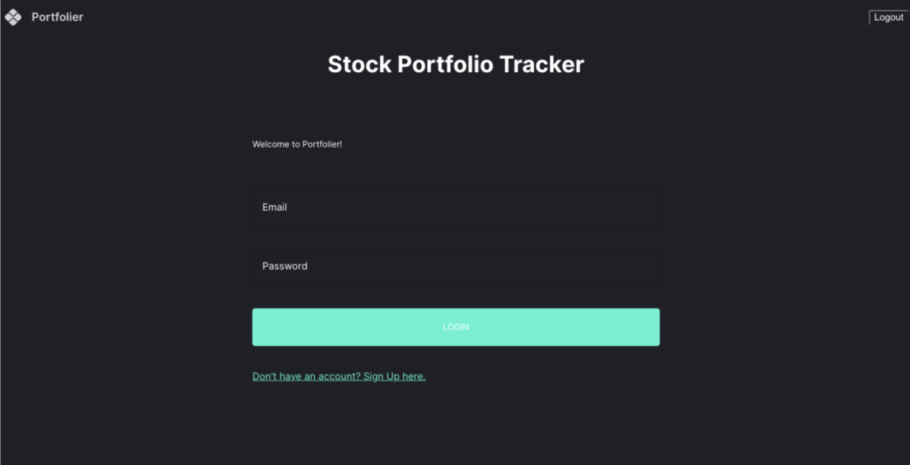
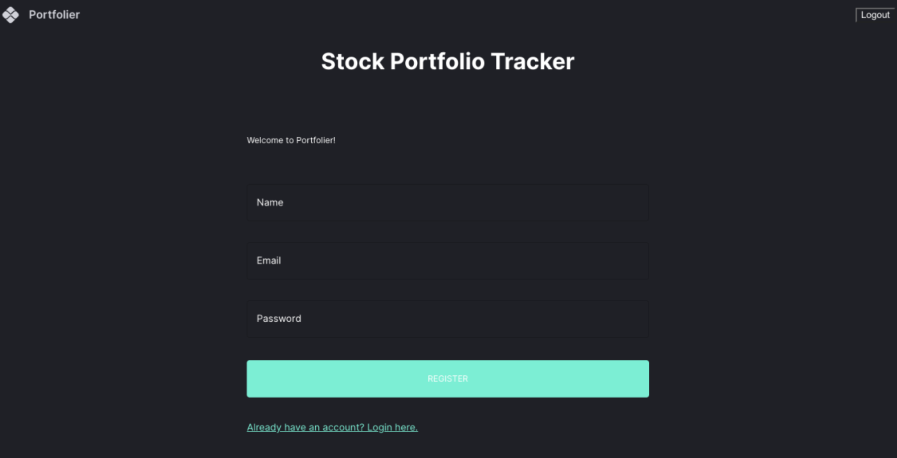
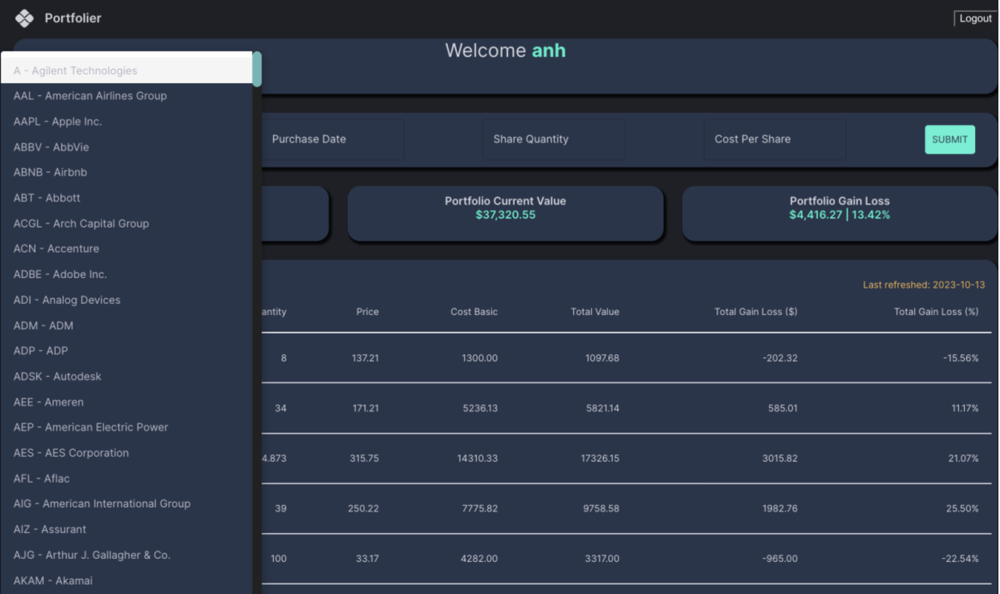
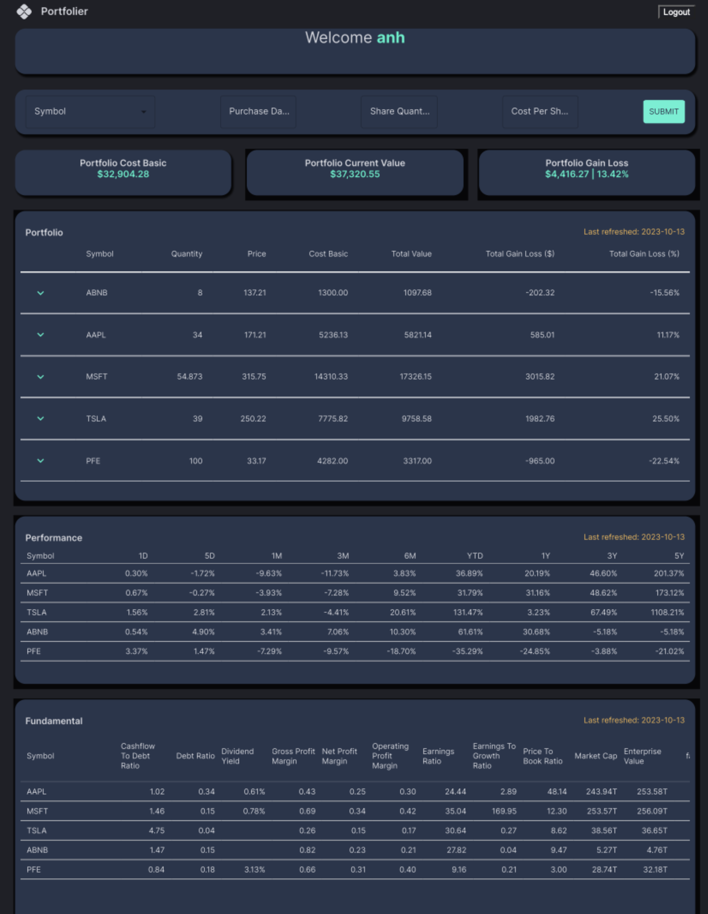

# Portfolio Tracker

A sample React dashboard application to track your stock portfolio.

## Installation

To install the required libraries for both the server and client, follow these steps:

1. Open your terminal.
2. Navigate to the server directory and install the dependencies:
   ```bash
   cd server
   npm install
    ```

3. Navigate to the client directory and install the dependencies

    ```bash
    cd client
    npm install
    ```

## Start the application in development

1. Open your terminal.
2. Navigate to the server directory:
    * Provide the Environment variable in .env_template file and rename to .env file
    * Run below commands
   ```bash
   cd server
   npm run dev
    ```

3. Navigate to the client directory and Run the development server:

    ```bash
    cd client
    npm run dev
    ```

## Functionalities

1. Authentication: 
- Users can register and then log in with their username/password to view their portfolio





2. Portfolio Management: 
- Users can add or remove stocks from their initial portfolio by entering the stock ticker, number of shares, and purchase price.



3. Portfolio Dashboard: 
* Users can view a summary of their portfolio performance and financial data on a dashboard that includes the following components:
    
    * Dashboard Summary: Four boxes that display the current portfolio value, total
    portfolio return, total gain (sum of positive returns), and total loss (sum of
    negative returns).
    * Table 1: Portfolio Return: A table that lists the following information for each
    stock in the portfolio: stock ticker, number of shares, cost per share, total cost,
    current price per share, total value, and return per stock.
    * Table 2 : Stock Performance: A line chart that show each stock return across
    different time period from 1D to 10Y Return
    * Table 3: Fundamental KPIs: A table that shows the fundamental financial key
    performance indicators (KPIs) of each company in the portfolio. The KPIs may
    include income ratio, asset and debt metrics, and rating.




## Tools Used

| Technologies              | Tools                          |
|------------------------|----------------------------------|
| Operating Systems      | MacOS                            |
| Programming Language   | Python, JavaScript, and Typescript|
| IDE                    | Visual Studio Code               |
| Frontend Framework     | ReactJS                          |
| Dashboard Visualization| Recharts, Material UI            |
| Backend Framework      | ExpressJS                        |
| JavaScript Runtime     | NodeJS                           |
| State Management       | Redux                            |
| Database               | NoSQL (MongoDB)                  |
